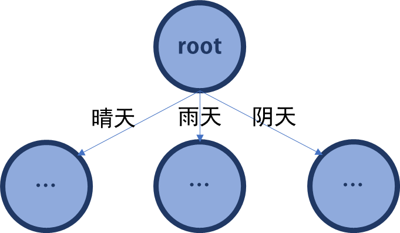

# Decision Tree with Descret Inputs

## 离散决策树

实际上，如果不要求决策树的“最简单化”，每个节点遇到一个新的feature，就往下新建一个feature节点，主打一个枚举emmm。

当然，如果要求决策更加简单，那么就需要每次计算节点的时候，让系统最大程度的**变得不那么乱。**

## 概率和熵

### 同时发生的独立事件

相互独立的两个事见，有：
$$
P(X,Y)=P(X)\cdot P(Y)
$$
两边取对数可知：
$$
log_2(P(X,Y))=log_2(P(X))+log_2(P(Y))
$$
显而易见，概率越大，那么不确定性越小；概率越小，那么不确定性越大。

### 系统的混乱程度和概率

熵通常用来表示系统的混乱程度。（化学必修2，选修3）定义一个集合中，出现i情况的概率为Pi，那么这个系统的信息熵计算公式为：
$$
EN=-\sum_{i=1}^nP_i\ln (P_i)
$$
一个集合中，如果种类很多，那么熵值通常会比较大。如果种类少，那么熵值会比较小。观察上式发现，如果只有一种情况i，那么显然i出现在这个集合的概率$P_i=1$， 它的熵为0。**如果熵过大，那么说明这个集合的分类并不太好**，纯度不高。

因此，简化决策树，可以通过**计算每次分类后系统信息熵的变化，向熵减最快的方向**进行构建。

>  另一种描述系统混乱程度的描述-基尼系数Gini：
>  $$
>  Gini(p)=\sum_{k=1}^Kp_k(1-p_k)=1-\sum_{k=1}^Kp^2_k
>  $$

## 降低系统混乱程度-决策节点的选择

一个例子

| 天气（晴0雨1多云2） | 温度（热0，冷1，不冷不热2） | 湿度（高0低1） | 有无风（有1无2） | 是否去玩（labels） |
| ------------------- | --------------------------- | -------------- | ---------------- | ------------------ |
| 0                   | 0                           | 0              | 0                | 0                  |
| 0                   | 0                           | 0              | 1                | 0                  |
| 2                   | 0                           | 0              | 0                | 1                  |
| 1                   | 2                           | 0              | 0                | 1                  |
| 1                   | 1                           | 1              | 0                | 1                  |
| 1                   | 1                           | 1              | 1                | 0                  |
| 2                   | 1                           | 1              | 1                | 1                  |
| 0                   | 2                           | 0              | 0                | 0                  |
| 0                   | 1                           | 1              | 0                | 1                  |
| 1                   | 2                           | 1              | 0                | 1                  |
| 0                   | 2                           | 1              | 1                | 1                  |
| 2                   | 2                           | 0              | 1                | 1                  |
| 2                   | 0                           | 1              | 0                | 1                  |
| 1                   | 2                           | 0              | 1                | 0                  |

首先计算系统自身的初始熵值。

这份数据一共有14条。其中有9条数据label是1，5条是0。那么在这个数据集中，
$$
P(1)=\frac 9{14}\\
P(0)=\frac 5{14}
$$
且他们是独立的。

那么，原始label的熵为：
$$
EH=-P(1)log_2(P(1))-P(0)log_2(P(0))=0.940
$$
现在，枚举经过每个属性划分后的熵。

* 按照天气划分：

  在**晴天**发生的情况下，一共有**5条**数据。其中label=1有2条，等于0时有3条。
  $$
  P(1|晴天)=\frac25\\
  P(0|晴天)=\frac35\\
  \Rightarrow
  EN_{晴天}=-P(1|晴天)log_2(P(1|晴天))-P(0|晴天)log_2(P(0|晴天))=0.971
  $$
  同样可以计算出，**多云**下，$EN_{多云}=0$；下雨时，$EN_{下雨}=0.971$。

  现在，让我们来计算选择**天气**作为节点，来计算选择天气后的熵。

  | 天气                                            | 晴           | 多云         | 雨           |
  | ----------------------------------------------- | ------------ | ------------ | ------------ |
  | 天数                                            | 5            | 4            | 5            |
  | 权重（$P(这种天气)=\frac{该天气天数}{总天数}$） | $\frac5{14}$ | $\frac4{14}$ | $\frac5{14}$ |
  | 熵                                              | 0.971        | 0            | 0.971        |

  选取**天气**作为节点，有三个分支。选择晴天、多云、雨天的可能性（权重）分别如上表所示。那么最后的熵值是：
  $$
  \frac5{14}\cdot 0971+\frac4{14}\cdot0+\frac5{14}\cdot0.971=0.693
  $$
  经过这样分类后，系统的熵从0.940降低到了0.693，变低了0.247.其中0.247称为**信息增益**。表示的是从一个状态到另一个状态混乱程度的变化。正值代表混乱程度降低了。**信息增益**正值越大，降低混乱程度的效果越好。
  $$
  gain(天气)=EN(原始的信息熵)-EN(天气作为分支的信息熵)=0.247
  $$
  在c++中，这个方法的实现为：

  因此，选择**天气**作为节点，熵降低了0.247.

* 温度：$gain(温度)=0.029$

* 湿度：$gain(湿度)=0.152$

* 风：$gain(风)=0.048$

显然，使用天气作为根节点，熵下降的最快，即这样分类后，集合的混乱程度下降最快，分类效果更好。

这样，我们的第一层分类就变成了：

其它节点也是相同的办法。在我们新的节点内，考虑除了已经用过的判断条件（例如，在“晴天”，“雨天“，”多云”节点内，“天气”这个特征就**不应当被考虑**了），然后再一次对每个节点进行一次这样的运算。这就是创造这样一棵树的方式。

用递归的方分别式对天气为晴天、天气为多云、天气为阴天情况下，其它特征（温度、湿度、有无风）的情况下的判断。

## 公有方法

`class DecisionTree`决策树的实现类。

`DecisionTree(std::vector<std::vector<int>>& trainData, std::vector<int>& trainLabel);`构造器。传入参数为训练数据、训练数据对应的标签。

`int classify(std::vector<int>& testData);`分辨。传入一条测试数据，返回分类决策值。
