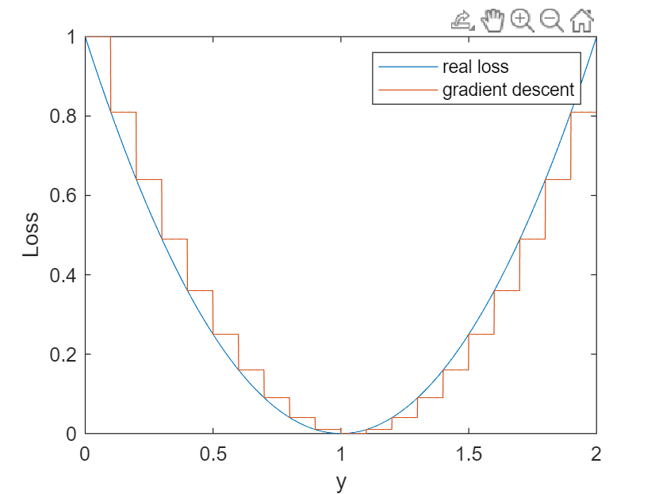
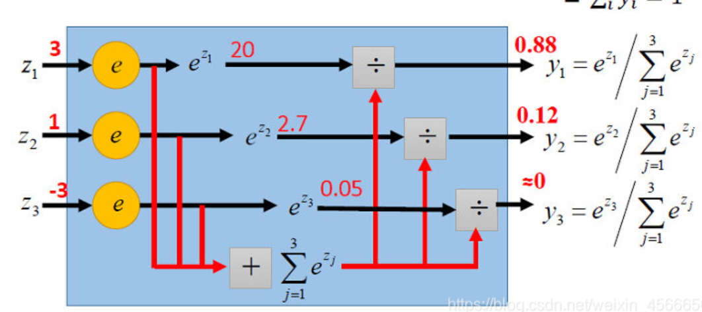

# Linear Regression

pass.

## 为什么可以通过梯度下降来寻找最优解？

我们知道，损失函数是一个凸函数。根据我们的更新公式，每一步更新，有：(为了方便起见，$b$偏置被当成一个输入恒定为1的常量)
$$
y^* = \omega^*x\\=(\omega-\lambda\frac{\partial L}{\partial \omega})x\\
\rightarrow \delta y=y^*-y=\lambda\frac{\partial L}{\partial \omega}x\\
=(\lambda x)\frac{\partial L}{\partial \omega}
$$
以二维坐标为例，损失函数关于预测值y的曲线大致为：

可以发现，变化的**y会最终导致损失函数发生变化**（注意，这里的y是自变量）。y的变化量正是上图中**红色折线水平方向的变化**，每一段的长度是$(\lambda x)\frac{\partial L}{\partial \omega}$(和每次迭代的x以及偏导数有关，上图仅作表述使用)。因而，梯度更新引起预测值发生变化后，最终导致损失函数发生变化，从而可以进行更迭。

# Logistic Regression

相当于线性回归模型经过了一个激活函数。详细请参考作者[Neuron_MLP](https://github.com/Ethylene9160/Neuron_MLP)仓库。

# Regression with Multiple Classification

多分类和softmax：多分类问题实质上是在原来的output layer上增添了几个输出。

# Appendix

## Regulation 正则化

通常，高次回归模型容易导致过拟合。例如：
$$
f(x)=\omega_0+\omega_1x+\omega_2x^2+\omega_3x^3
$$
容易导致过拟合出现的项，通常是高次项。因此，如果能缩小高次项系数的权重，就能减少过拟合的发生。

引入正则化参数$\lambda$。例如我们希望缩小三次项的权重，假设选取$\lambda=100$，将新的损失函数更正为：
$$
loss=((f(x)-y)^2+100\cdot \omega_3^2)
$$
这样的话，在更新损失函数的时候，$\omega_3$会尽最大努力向更小的权重方向更新。这样的话，最终得到的$\omega_3$会变得比较小。

## 为什么梯度通常是下降的

因为是凸函数，除非到了最低点或者局部最优点附近卡住了，总体的趋势仍然是下降的。